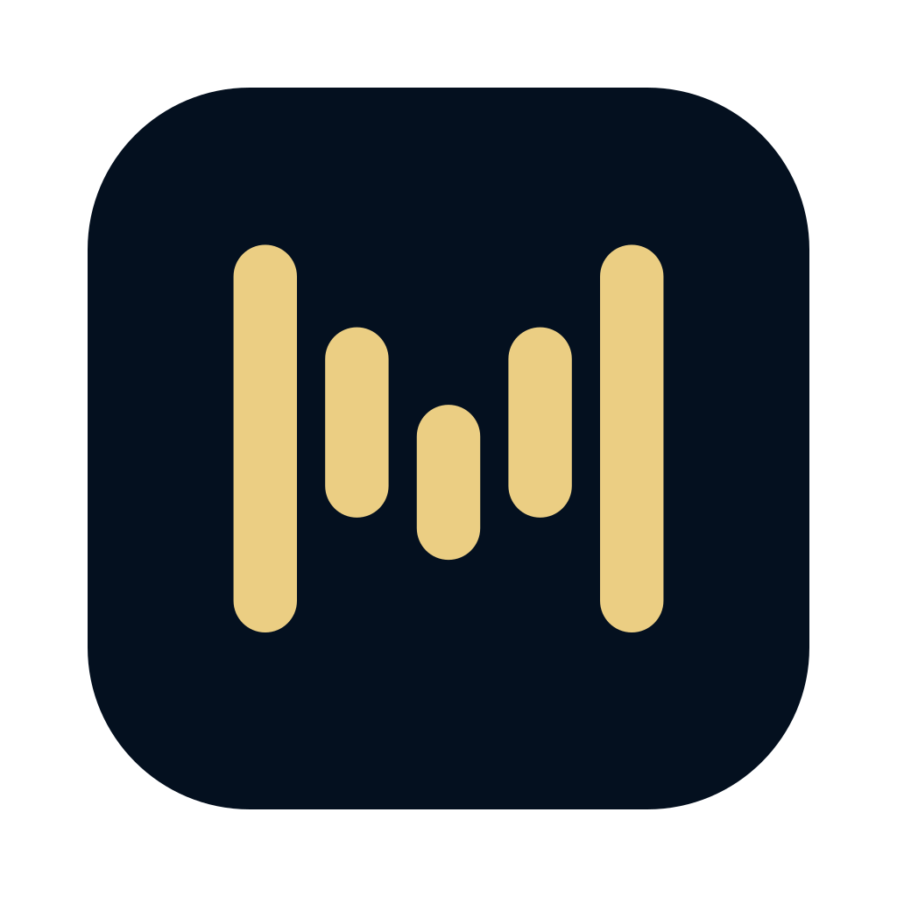
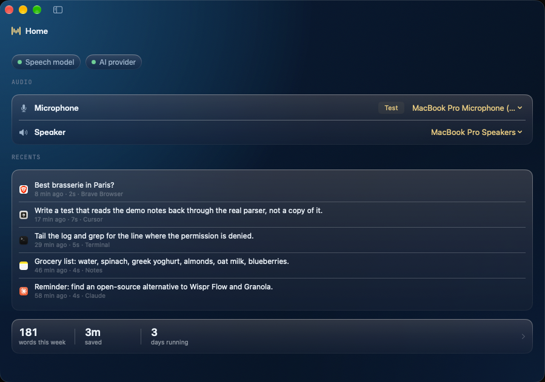
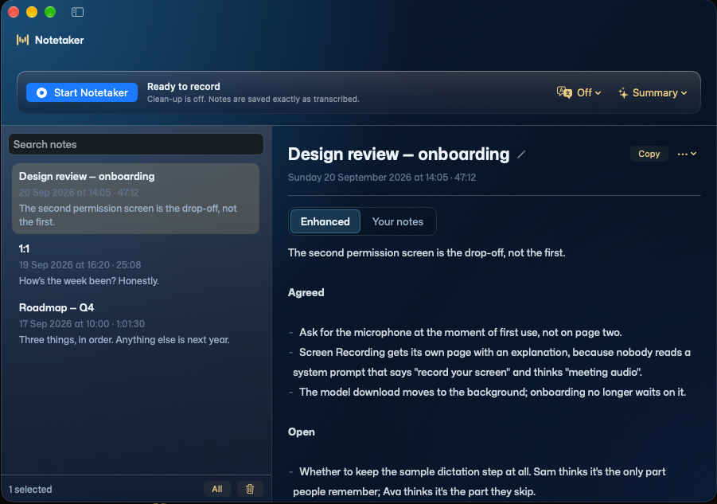

<p align="center">
  
</p>

<h1 align="center">Murmr Flow</h1>

<p align="center">
  <b>Dictation and notes for macOS, with the speech model on your Mac.</b><br />
  Hold a key and speak, or record what you are listening to.<br />
  Audio never leaves the machine — only text, and only to a provider you choose.
</p>

<p align="center">
  <a href="LICENSE"></a>
  
  <a href="https://github.com/mcathala/murmr-flow/releases/latest"></a>
</p>

---

**Two jobs.**

- **Dictation** — hold a hotkey, speak, and the text lands at your cursor. Any app, no
  integration.
- **Notetaker** — records your microphone and whatever is playing through the Mac, and
  writes a Markdown note above the transcript. A meeting, a call, a lecture, a podcast
  — or just you, thinking out loud.

Speech-to-text runs on-device. Only cleaned-up text is sent to an AI provider, and only
if you configure one.



## Install

### macOS

```sh
curl -fsSL "$(curl -fsSL https://api.github.com/repos/mcathala/murmr-flow/releases/latest \
  | grep -o '"browser_download_url": *"[^"]*\.zip"' | head -1 | cut -d'"' -f4)" \
  -o /tmp/MurmrFlow.zip \
  && unzip -oq /tmp/MurmrFlow.zip -d /Applications \
  && open "/Applications/Murmr Flow.app"
```

Or [download the latest release](https://github.com/mcathala/murmr-flow/releases/latest)
and drag it to `/Applications` — then right-click → **Open**, once, because the builds
are not notarized. The command above skips that: `curl` does not set the quarantine
flag that trips Gatekeeper.

Builds are ad-hoc signed, so until they are notarized each new release asks for
permissions again.

### Windows

Not yet. The blocker is the speech stack — the model runs on Apple's Neural Engine and
there is no drop-in equivalent.

### Permissions

| Permission | For |
|---|---|
| **Microphone** | Hearing you. |
| **Accessibility** | Noticing the hotkey while another app is focused, and typing the text into it. |
| **Screen Recording** | Hearing what the Mac is playing. macOS files the system-audio grant here; nothing looks at your screen and no video is captured. |

Each is asked for at the moment it is needed. Dictation works with the microphone
alone.

The speech model (~600 MB) downloads once on first use. After that the app works
offline.

## Dictation

Hold the hotkey, speak, release. The text appears at the cursor in whatever app is in
front.

Clean-up turns the raw speech into punctuated, filler-free prose. It is optional, and
the only step that sends anything off the machine — if the provider is slow, down or
refuses, the raw transcript is typed instead. Both versions are kept, so you can see
what clean-up changed and re-run it against a different prompt without speaking again.

## Notes from anything you hear

The notetaker records your microphone and whatever is playing through the Mac:

- **Meetings and calls**, where the speaker labels do real work.
- **Lectures, courses and tutorials** — one person talking, you chipping in.
- **Podcasts and videos**, where nothing comes from your microphone at all.
- **Thinking out loud**, with nothing playing.

You get a Markdown file: a written note at the top, your own typed notes kept separate
beneath it, and the speaker-labelled transcript below that.



Notes live in `~/Documents/MurmurNotes` as plain Markdown with YAML front matter. The
file is the source of truth, not a database: edit one in any editor and the app
re-reads it, delete one in Finder and it is gone. The notes outlive the tool.

## What stays on the machine

- **Speech-to-text** runs on-device with NVIDIA's Parakeet models, through
  [FluidAudio](https://github.com/FluidInference/FluidAudio) on the Neural Engine.
- **Dictation audio** lives in memory only and is gone once the text is typed. The log
  of what was said is at `~/Library/Application Support/Murmr Flow/dictations.jsonl`.
- **Recorded audio** is deleted as soon as the note is saved. The note is the only copy.
- **API keys** are in the macOS Keychain.
- **What leaves** is the transcript text, sent to the clean-up provider you configure —
  and nothing at all if you configure none.

No account, no telemetry, no server belonging to this project.

## AI clean-up

Any server that speaks the OpenAI chat API works. Settings › AI clean-up offers:

| Provider | Needs a key |
|---|---|
| Groq | yes |
| Cerebras | yes |
| Ollama Cloud | yes |
| OpenRouter | yes |
| Google Gemini | yes |
| Custom — any OpenAI-compatible URL | no, unless the server asks |

Custom is how a local model runs: point it at Ollama (`http://localhost:11434/v1`) or
LM Studio (`http://localhost:1234/v1`) and nothing leaves the machine at all.

## Building from source

### Requirements

- macOS 14 or later, Apple Silicon
- Xcode 26, or the matching Command Line Tools alone
- A code signing certificate — `security find-identity -v -p codesigning` to check.
  If you have none, `./scripts/make-cert.sh` makes a persistent self-signed one. This
  matters: macOS ties permission grants to the signature, so an unstable identity
  resets them on every rebuild.

### Build

```sh
./scripts/build.sh      # compile, assemble the .app, sign it
./scripts/install.sh    # copy to /Applications and launch
```

`build.sh` accepts `CONFIG=release`, `UNIVERSAL=1`, `VERSION=` and `SIGNING_IDENTITY=`.

### Tests

```sh
swift test
```

With Command Line Tools but no Xcode, `swift-testing` is off the default search paths
and this fails with `no such module 'Testing'`. Point at the CLT copy:

```sh
FW=/Library/Developer/CommandLineTools/Library/Developer/Frameworks
LIB=/Library/Developer/CommandLineTools/Library/Developer/usr/lib
swift test --arch arm64 -Xswiftc -F"$FW" -Xlinker -F"$FW" \
  -Xlinker -rpath -Xlinker "$FW" -Xlinker -rpath -Xlinker "$LIB"
```

Snapshot suites write PNGs when `MURMR_SNAPSHOT_DIR` is set — the quickest way to look
at a view without launching the app.

### Layout

```
Package.swift              SwiftPM executable; no .xcodeproj by design
src/murmr-flow/            app code — app/, core/, dictation/, meetings/
resources/                 Info.plist and entitlements templates
scripts/                   build, install, verify, helpers
tests/                     swift-testing suites
docs/screenshots/          the images above
```

Files and directories are lowercase `kebab-case`; Swift *type* names stay `PascalCase`.
Xcode can open `Package.swift` directly.

### Scripts

| Script | Does |
|---|---|
| `dev.sh` | Rebuild, install, relaunch (`--fresh` for a new-user run) |
| `build.sh` | Compile, assemble the `.app`, sign it |
| `install.sh` | Copy to `/Applications` and launch |
| `build-adapter.sh` | Build the vendored mediaremote-adapter framework |
| `build-icon.sh` | Rasterise the app icon from the brand SVG |
| `release.sh` | Build, zip, tag, publish to GitHub Releases |
| `verify-signing.sh` | Print signature, Team ID, CDHash, entitlements |
| `make-cert.sh` | Create a persistent self-signed certificate |
| `reset-permissions.sh` | Revoke permission grants to retest the flow |
| `demo-data.sh` | Swap your notes and history for invented ones (`--restore` undoes it) |
| `screenshot.sh` | Capture the main window to `docs/screenshots/` |

### Screenshots

The images above come from invented data. `demo-data.sh` moves your own notes and
history aside and writes fiction in the formats the app already reads, so nothing in
the app knows it is being photographed; `demo-data-tests.swift` reads that fiction back
through the real parsers, so a format change breaks the test rather than quietly ageing
the screenshots.

```sh
./scripts/demo-data.sh            # invented notes and history in place of yours
./scripts/screenshot.sh home      # with Home open
./scripts/screenshot.sh notes     # with Notetaker open and a note selected
./scripts/demo-data.sh --restore  # your own data back
```

Captured with `-o` so no drop shadow is baked in — a shadow is wrong against every
background but the one it was taken on.

Capturing another app's window needs Screen Recording, which macOS grants to the
terminal and which a script cannot grant itself. Without it, take the shot with ⌘⇧4 and
file it: `./scripts/screenshot.sh home --adopt`.

## Contributing

Issues and pull requests welcome. Lowercase `kebab-case` filenames, `PascalCase` Swift
types, and a comment earns its place by saying *why*. `swift test` green before you
open a PR.

## Acknowledgements

- [FluidAudio](https://github.com/FluidInference/FluidAudio) — the Neural Engine runtime.
- [NVIDIA Parakeet](https://huggingface.co/nvidia) — the speech models.
- [Mona Sans](https://github.com/github/mona-sans) and
  [JetBrains Mono](https://github.com/JetBrains/JetBrainsMono) — the bundled typefaces.

## Licence

[MIT](LICENSE).
